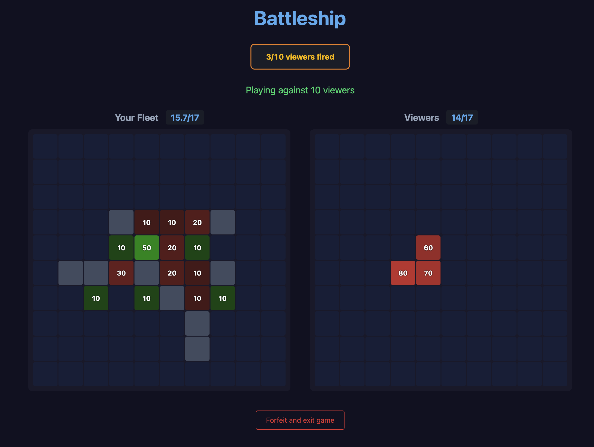

# Battleship



Play it live [here](https://d5rqyvhtzgfip.cloudfront.net)

---

## The Spike: Streamer Mode

When I started this project, I didn't ask "how do I build Battleship?" I asked "what would make Battleship interesting in 2026?"

Battleship is fast, simple, and conversational. You can play while talking. That made me think about Twitch—where streamers are constantly looking for ways to engage their audience beyond just watching gameplay. What if a streamer could play Battleship against their entire chat at once?

That's Streamer Mode: one player versus up to 500 viewers simultaneously. The streamer places their ships and fires like normal. But on the other side, every viewer is playing the same board, and their collective guesses aggregate into a heat map. The streamer isn't playing against one person—they're playing against the crowd.

### Why This Is Technically Interesting

Traditional multiplayer is straightforward. Two clients, one server, bidirectional updates. When Player A fires, you notify Player B. Done.

Streamer Mode breaks that model. When the streamer takes a single action, the server has to broadcast updates to 500+ concurrent WebSocket connections. When any viewer fires, the heat map updates for everyone. This isn't just "more users"—it's a fundamentally different scaling shape. Fan-out at this scale requires thinking carefully about connection management, message batching, and how your infrastructure handles burst traffic.

I built this entirely on AWS serverless: API Gateway WebSockets, Lambda for game logic, DynamoDB for state. Serverless was the right choice here because it scales to zero when nobody's playing (cost), handles burst traffic naturally (the 500-viewer spike), and let me focus on the game logic rather than managing infrastructure.

### Constraints I Embraced

This was built on my personal AWS account, entirely within free tier. That sounds like a limitation, but it forced good decisions. I had to think about efficiency from the start—how to minimize Lambda invocations, how to structure DynamoDB access patterns, how to keep WebSocket connections lean.

The result: the architecture comfortably supports 10,000+ concurrent users under normal load, with burst capacity closer to 20-25K. For a prototype built in free tier, that's the kind of headroom that tells me the foundations are solid.

### What I'd Build Next

This is a prototype, and I know where the gaps are:

- **Turn timer**: Players can currently sit idle indefinitely. Production needs a timeout that skips or forfeits.
- **Rate limiting & WAF**: No throttling in place—this is vulnerable to abuse at scale.
- **IAM hardening**: Used root credentials for speed; production would use scoped IAM roles.
- **Client optimizations**: The frontend waits for server responses on every action. Optimistic updates would make it feel snappier.
- **UI/UX polish**: Functional, not pretty. Doesn't adapt well to mobile or varying screen sizes.

I mention these not as excuses, but because I think knowing what's missing is as important as knowing what's there. I built this thinking about production from day one, even while shipping a prototype.

### The Mindset

I approached this project the way I approach any problem: understand where it fits before deciding how to build it. Streamer Mode wasn't a technical exercise—it was a product hypothesis that happened to require solving a real scaling challenge.

I like going deep. I like understanding systems well enough to know where they'll break and where they have room to grow. And I like building foundations that let a team move fast without accumulating hidden debt.

---

## Technical Overview

**Stack**: React + TypeScript (Vite) / AWS Lambda / API Gateway WebSockets / DynamoDB / CloudFront + S3

**Game Modes**:
- **AI**: Single player vs server-side AI with probe-based targeting
- **PvP**: Two players via shared game ID, real-time sync
- **Streamer**: 1 vs up to 500 viewers with heat map aggregation

**Architecture**:
```
CloudFront ─┬─ S3 (React SPA)
            └─ API Gateway (WebSocket) ─ Lambda ─ DynamoDB
```

All game logic is server-authoritative. Clients send actions, server validates and broadcasts state.

## Local Development

```bash
# Deploy full stack
./deploy.sh

# Client dev server
cd client && npm install && npm run dev
```
